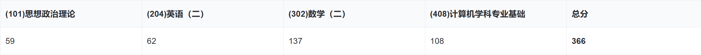
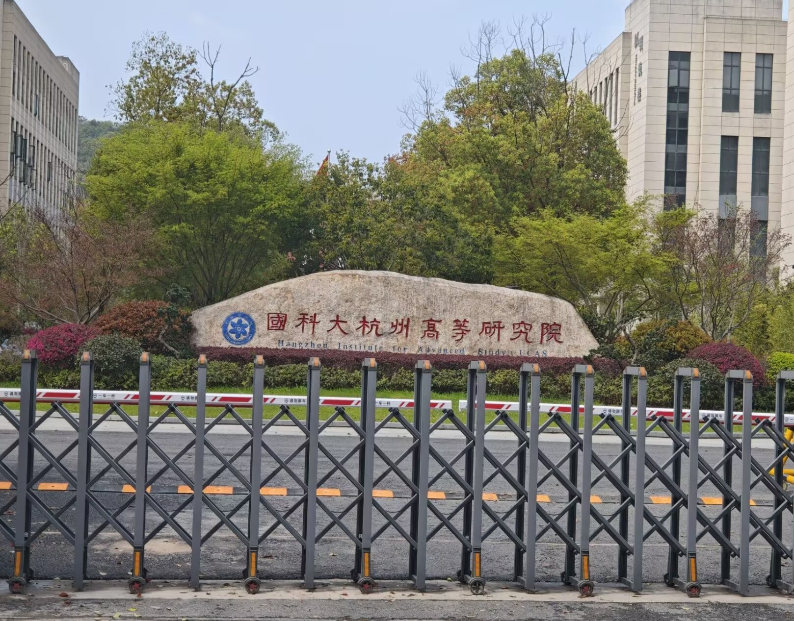

这是楼主今年一战上岸杭糕人工智能的经验贴，希望对大家有所帮助（仅供参考，都是楼主的主观想法，每个人都有自己的想法，找到适合自己的方法是最重要的，如果你觉得的我说的是一坨，那你是对的，我是错的（再次叠甲，不要开楼主盒😭，球球大家了😭)。
### 关于我
楼主是双非三🈚选手，绩点前20%（大学第一年烂完了😭，不知道上大学可以保研，当然学院一言难尽的制度也轮不到我保研😭），四级刚过线，六级考了四次没过，英语一直是我的弱项。唯一拿的出手的是有一段实习。 接下来我将从择校，备考，复试三个方面展开叙述。
### 择校
首先楼主选择的是22408，原因是招人会多一点相比于11408，而且408统考会方便调剂。在选择22408的前提下，学校选择就好多了，你要是想一举成名，可以试试南软和科软（哈哈😊）。楼主是财迷，想在研究生阶段自给自足，研究所是一个不错的选择，比如计算所，软件所，杭糕。不过今年的自命题也可以的（比如北航等额复试）。结合今年的情况，如果大家要想有调剂，还得上11408才有可能调剂。总的来说：调剂既吃分数，又吃本科。考22几乎莫调剂😭。
### 备考经历
#### 时间安排
楼主是从3月初开始准备的，前期的内容是英语背单词，数学和408过一遍基础和写基础题。大概持续到六月份，平时没课的话我就去图书馆，大部分课都比较少，重心大多放在考研上。六月份之后就开始了数学和408的强化阶段，这在之后完全没课了，基本上是图书馆全勤，中间完成了一段实习，那段时间太累了，一周实习三天，然后剩余时间考研，一周无休😭。九月后是以写试卷和背政治为主，好累😭（楼主每天早九晚十一。大家如果全程有个搭子，非常不错）
#### 英语
楼主的英语很差劲，相信各位的英语大部分是比我好的，而我这么差劲的英语都能60（英语二），可见英语二的难度是不大的。楼主前期一直都是晚上背英语单词，写英语真题试卷，大概完成2篇阅读，然后去B站的柴荣老师听讲解，后期就是背石雷鹏的范文。一天花在英语的时间不到2小时。如果单词背多了，以大家的实力，拿下70分的英语二各位是没问题的😊。
#### 政治
从真正意义上来说，政治是从10月才开始准备的，由于是京区，政治是众生平等，跟着肖老没问题的（虽然今年肖老没有压到大题😊），背背肖四，看看背诵手册，楼主后期花在政治的时间大概不到2个小时，60分足矣，如果报考的是水区，那或许是要多费点功夫
#### 数学
楼主从小底子就好，21年乙卷135😊，5月份左右过完了基础阶段，就把线性代数和高等数学过了一遍。数学二的内容是最少的，学起来比较轻松。但奉劝各位不要成为耐听王，多做题才是硬道理，楼主数学大部分时间花在写题上，可能是野路子，几乎没有怎么听课，1000，880，660，这些都写了，后期的卷子（张宇，李林，合工大）几乎都有刷了一遍（楼主感觉写数学有点过拟合的趋势，哈哈😊），从暑假开始我开始写真题试卷（严格按照三小时），后期是上午写完整的一张数学模拟试卷，然后快速对答案。楼主数学底子好，给大家的参考不多，如果要我推荐的话，大家可以试试多看看张宇的强化书（高等数学和线性代数），大家可以把它当做参考书，多翻一翻，数学理解推导过程和思想是最重要的。
#### 专业课
从这个成绩来说，楼主对408对掌握程度并不高，虽然是科班选手，几乎把一天的下午全给了408，大概四个半小时左右一天，但是取得的成绩太糟糕了，应该是后面的大题写的很差😭。学习顺序是数据结构，计算机组成/操作系统，计算机网络。前期楼主全程跟着王道咸鱼老师，写下书后的选择题和一些真题，计算机网络的湖科大教书匠非常不错。后期是下午刷一张完整的408试卷（三小时），408的真题卷大概是15张左右，可以二刷一遍或者试试王道、竟成的模拟卷。408很难，内容多，知识点杂，几乎没有重点，就拿今年考的除法器来说，根本不知道老头会出什么冷门考点。大家多翻一翻教材（学有余力），因为王道的书不一定是全的，多翻教材＋思维导图，相信大家多花点时间在408，分数不会低的，肯定可以拿到100左右的分数。
### 复试
复试可能包括英语问答，上机，面试，笔试。楼主是面试拷打，现在大部分院校是初试和复试五五开（或者六四），复试挺重要的，准备好项目和英语，不要紧张就能正常发挥，面试的老师大部分比较和善的😊。

### 最后
希望我的经验对大家有所帮助，也欢迎大家报考杭糕，今年分数这么高，明年肯定抄底😊，附上今年26的招生图 祝大家考研顺利！ （学校其实好小😭）